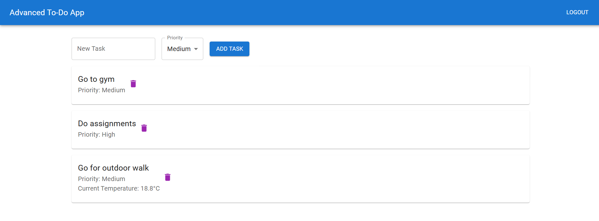
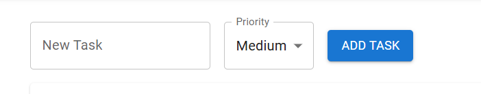
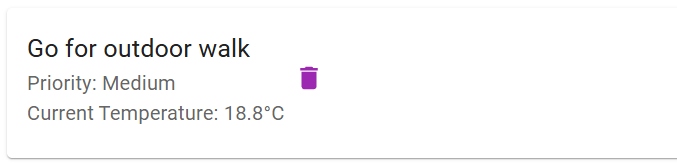

# React + Vite To-Do App with Redux

This project is a To-Do application built with React, Vite, and Redux. It includes features such as task management, authentication, and weather information for outdoor tasks.

## Features

- **Task Management**: Add, delete, and clear tasks.
- **Authentication**: Login and logout functionality.
- **Weather Information**: Fetches weather data for tasks containing the word "outdoor" with "Medium" priority.

## Setup and Running Instructions

1. **Clone the repository**:
    ```sh
    git clone https://github.com/Prathamgupta661/todo_redux.git
    cd todo_redux
    ```

2. **Install dependencies**:
    ```sh
    npm install
    ```

3. **Run the development server**:
    ```sh
    npm run dev
    ```

4. **Build for production**:
    ```sh
    npm run build
    ```

5. **Preview the production build**:
    ```sh
    npm run preview
    ```

## Screenshots

### Task List


### Add Task


### Weather Information


## Additional Information

- The weather API works only if the user types "outdoor" and the priority is "Medium".
- The application uses Redux for state management and Redux Thunk for asynchronous actions.

## Expanding the ESLint configuration

If you are developing a production application, we recommend using TypeScript and enable type-aware lint rules. Check out the [TS template](https://github.com/vitejs/vite/tree/main/packages/create-vite/template-react-ts) to integrate TypeScript and [`typescript-eslint`](https://typescript-eslint.io) in your project.
